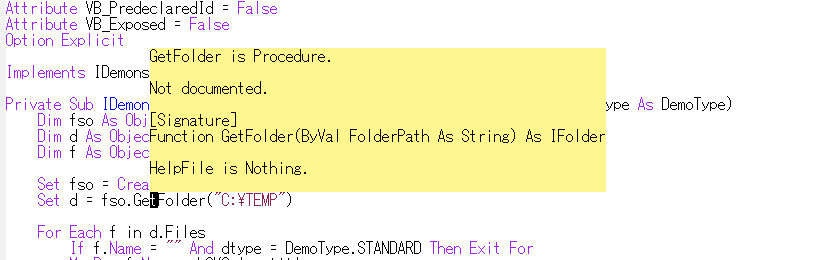
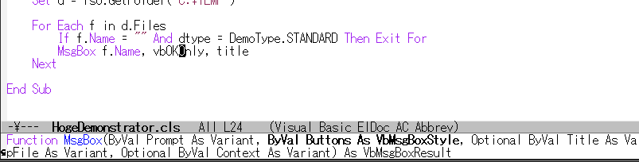
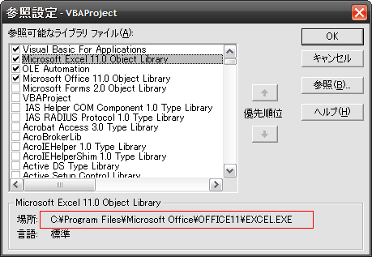

これは何？
==========

EmacsでVisual Basic Editorと同じようなVBA開発の環境を提供するEmacsの拡張です。


特徴
====

### 入力補完

以下のコンテキストにおいて、適切な補完候補が表示されます。

* 標準/クラス/フォームのモジュールのメンバ
* Implementsするインタフェース
* As/Newするクラス
* CreateObjectに渡すProgID
* Setする変数
* Enumな引数


※詳しくはデモを参照して下さい。

### ヘルプ表示

ポイントしている要素についてのヘルプを、ポップアップ表示します。  



### メソッドシグネチャ表示

ポイントしているメソッドのシグネチャをミニバッファに表示します。  



### 定義元ジャンプ

ポイントしているメソッドの定義元へタグジャンプできます。  

### Objectな変数の型推論

以下の場合は、Object型で宣言した変数でも適切な補完が可能になります。

```vb
Set x = ...
'=の後の文脈から、型が特定できる場合
```

```vb
For Each x In ...
'Inの後の文脈から、Collection型が戻される場合
```

※詳しくはデモを参照して下さい。

### インタフェースメソッドの実装の自動化

Implementsしたインタフェースのメソッドは以下のようなメソッドとして実装する必要があります。  

* メソッド名を"インタフェース名_メソッド名"にする
* スコープをPrivateにする

上記のメソッド定義を以下の場合に、自動挿入するようにしています。

* Implementsするインタフェースの補完選択後、確認メッセージに対してyとした時
* M-x `vbasense-insert-implement-definition` を実行した時

※詳しくはデモを参照して下さい。


デモ
====

http://www.youtube.com/watch?v=6QUXUz6HeTs


インストール
============

### package.elを使う場合

2014/01/09 melpaリポジトリからインストール可能  

### el-get.elを使う場合

2014/02/01 利用可能。ただし、masterブランチのみです。  

### gitコマンドを使う場合

    git clone https://github.com/aki2o/emacs-vbasense.git

上記を実行後、vbasense.elがあるディレクトリにload-pathを通す。  

※下記の依存拡張もインストールする必要があります。  

### 手動の場合

アーカイブをダウンロード、展開して、出来たディレクトリにload-pathを通す。  

※下記の依存拡張もインストールする必要があります。  

### 依存拡張

* [auto-complete.el](https://github.com/auto-complete/auto-complete)
* [log4e.el](https://github.com/aki2o/log4e)
* [yaxception.el](https://github.com/aki2o/yaxception)


設定
====

```lisp
(require 'vbasense)

;; ポイントしている要素についてのヘルプをポップアップ表示するキー
(setq vbasense-popup-help-key "C-:")

;; ポイントしているメソッドの定義にジャンプするキー
(setq vbasense-jump-to-definition-key "C->")

;; 以下は必要な場合、適宜カスタマイズ
;; (add-to-list 'vbasense-tli-files "c:/Program Files/Common Files/System/ado/msado21.tlb")
;; (setq vbasense-cache-directory "c:/TEMP/vbasense")
;; (add-to-list 'vbasense-enable-modes 'hoge-mode)
;; (add-to-list 'vbasense-ac-trigger-command-keys "=")
;; (add-to-list 'vbasense-user-library-directories "c:/MyVBALibraray")
;; (setq vbasense-setup-user-library-function (lambda () (vbasense-load-project)))
;; (add-to-list 'vbasense-ac-implicit-enummember-prefixes "mso")
;; (setq vbasense-lookup-current-buffer-threshold 15000)

;; 推奨設定を行う
(vbasense-config-default)
```

※上記の適宜カスタマイズとなっている項目については留意事項を参照して下さい。  


留意事項
========

### vbasense-tli-files

Visual Basic Editorの参照設定で指定するライブラリファイルのリストです。



Visual Basic Editorで参照設定を追加するのと同じく、  
このリストにライブラリファイルを追加することで、  
そのライブラリのオブジェクトが補完できるようになります。  

### vbasense-cache-directory

`vbasense-tli-files`のライブラリ情報を保存するディレクトリです。

### vbasense-enable-modes

本拡張を有効にするメジャーモードのリストです。  
デフォルトでは`visual-basic-mode`のみになっています。  

※本拡張はfont-lockの有無には影響されませんので、必ずしも専用のモードである必要はありません。  
※visual-basic-mode.elはEmacsWikiからダウンロードできます。  

### フックがないメジャーモードで使う場合

バッファを開いただけでは本拡張が有効になりません。  
M-x `vbasense-setup-current-buffer` を実行して下さい。

### TypeLibInfoの取得

上記の`vbasense-tli-files`のライブラリファイルに定義された情報はTypeLibInfoと呼ばれ、  
これを取得するためにはTLBINF32.DLLというDLLが必要です。  
`vbasense-enable-modes`のモードのバッファを開いた時、または、M-x `vbasense-load-library` を実行した時、
以下のメッセージが表示された場合、TLBINF32.DLLがインストールされていません。

    [VBASense] Not yet regist TLBINF32.DLL

その場合は、TLBINF32.DLLを登録する必要があります。  

※私の環境のTLBINF32.DLLがcontribディレクトリに置いてあります。  
※私の環境のTLBINF32.DLLは[ここ](http://jp.dll-files.com/tlbinf32.dll.html)からダウンロードしたものです。  
※TLBINF32.DLLはVisual Basic 6.0をインストールすると、一緒にインストールされるそうです。  

### 独自コンポーネント

`vbasense-tli-files`のライブラリ情報以外の独自コンポーネントの情報を本拡張に認識させるためには、  
以下のいずれかを行う必要があります。

* 該当ファイルを開く
* `vbasense-user-library-directories`に独自コンポーネントが存在するルートディレクトリを追加する
* `vbasense-setup-user-library-function`をカスタマイズする

`vbasense-setup-user-library-function`向けの機能として、以下があります。

* `vbasense-load-directory` ... 指定されたディレクトリ配下を再帰的に検索
* `vbasense-load-recently` ... `recentf-list`を検索
* `vbasense-load-project` ... [anything-project.el](https://github.com/imakado/anything-project)を使って検索

※`vbasense-setup-user-library-function`のデフォルトは以下のようになっています。  

```lisp
(setq vbasense-setup-user-library-function
      (lambda ()
        (dolist (dir vbasense-user-library-directories)
          (vbasense-load-directory dir))))
```

※検索はバックグラウンドで実行されるため、情報が補完候補などに反映されるまでにタイムラグがあります。

### vbasense-ac-trigger-command-keys

入力と同時に`auto-complete`を実行するキーのリストです。  

### vbasense-ac-implicit-enummember-prefixes

Visual Basic EditorではEnumのメンバを直接補完できます。  

```vb
Public Sub main()
    VbMsgBoxResult.   ' <- このようにEnumを指定しなくても、
    vb                ' <- これだけでvbOKなどが補完候補に現れる
End Sub
```

本拡張で同様のことを行うと、パフォーマンスが悪くなってしまうため、  
`vbasense-ac-implicit-enummember-prefixes`にある文字列が入力された時のみ  
直接補完できるようにしています。

### vbasense-lookup-current-buffer-threshold

適切な補完候補表示のために、カレントバッファに定義しているFunction/Sub/Property/Type/Enumは、  
`auto-complete`が実行される度に最新の定義内容を取得しています。  
しかし、バッファが大きくなってくるとパフォーマンスが低下してしまうため、  
バッファサイズが`vbasense-lookup-current-buffer-threshold`を超えた場合は、  
最新を取得せずに補完候補を表示します。  

※バッファが保存されたタイミングでは、必ず最新の定義内容が取得されます。  


動作確認
========

* Emacs ... GNU Emacs 24.2.1 (i386-mingw-nt5.1.2600) of 2012-12-08 on GNUPACK
* auto-complete.el ... 1.4.0
* log4e.el ... 0.2.0
* yaxception.el ... 0.1


**Enjoy!!!**

