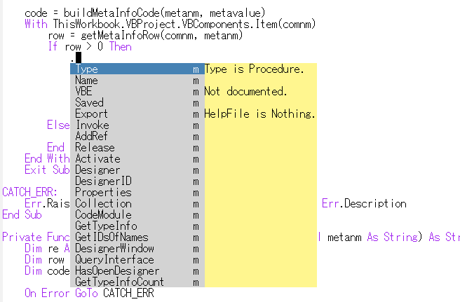
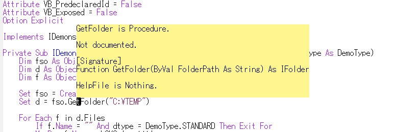
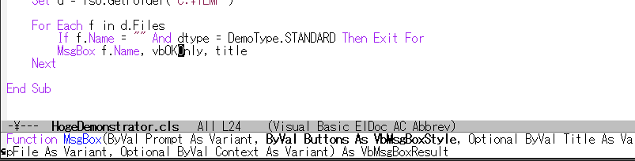
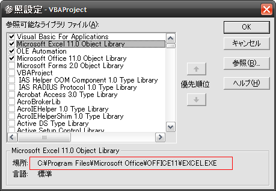

[Japanese](https://github.com/aki2o/emacs-vbasense/blob/master/README-ja.md)

What's this?
============

This is a extension of Emacs.  
VBASense provides a environment like Visual Basic Editor for developing VBA.  


Feature
=======

### Code assist

VBASense do code assist on the following context.  

* Member of BasicModule/ClassModule/FormModule
* Interface on Implements statement
* Class on As/New statement
* ProgID as argument of CreateObject
* Variable on Set statement
* Member of Enum on procedure argument



\* For detail, see Demo section.  

### Popup Help

VBASense pop-up help about the pointed element.  



### Show signature of procedure

VBASense show signature of the pointed procedure in mini-buffer.  



### Jump to definition

You can jump to definition of the pointed element.  
Also, you can return from the definition by `pop-tag-mark`.  

### Type Inference about the "Object" variable

In the following case, VBASense provide the optimized completion
about the variable that is defined as "Object".  

```vb
Set x = ...
'If the type is detected from the context after "="
```

```vb
For Each x In ...
'If the type, that is detected from the context after "In", is Collection
```

\* For detail, see Demo section.  

### Implement procedure of interface automatically

You need to implement the definition with fulfilling the following condition
about procedure of the interface that put on Implements statement.  

* Name "_INTERFACE_&#x5f;_PROCEDURE_" to the procedure name
* Set "Private" to the procedure scope

VBASense insert the above definition automatically in the following case.  

* You select the candidate of completion in Implements statement, and you answer "y" for the confirm message.
* You execute M-x `vbasense-insert-implement-definition`.

\* For detail, see Demo section.  


Demo
====

http://www.youtube.com/watch?v=6QUXUz6HeTs


Install
=======

### If use package.el

2014/01/09 It's available by using melpa.  

### If use el-get.el

2014/02/01 It's available. But, master branch only.  

### If use git command

    git clone https://github.com/aki2o/emacs-vbasense.git

Then, add the directory that has vbasense.el to load-path.  

\* In this case, you need to install the following dependency.  

### Manually

Download this archive and expand it.  
Then, add the directory that has vbasense.el to load-path.  

\* In this case, you need to install the following dependency.  

### Dependency

* [auto-complete.el](https://github.com/auto-complete/auto-complete)
* [log4e.el](https://github.com/aki2o/log4e)
* [yaxception.el](https://github.com/aki2o/yaxception)


Configuration
=============

```lisp
(require 'vbasense)

;; Keybinding
(setq vbasense-popup-help-key "C-:")
(setq vbasense-jump-to-definition-key "C->")

;; Make config suit for you. About the config item, eval the following sexp.
;; (customize-group "vbasense")

;; Do setting a recommemded configuration
(vbasense-config-default)
```

\* About the item that you should be careful, see Consideration section.  


Consideration
=============

### vbasense-tli-files

This value is list of the library file that is referred in Visual Basic Editor.



As you add the reference on the above dialog,  
you need to add the library file to this list for the completion about the library.  

### vbasense-cache-directory

This value is the directory that the library infomation of `vbasense-tli-files` is saved in.

### vbasense-enable-modes

This value is list of the major mode that VBASense is activated on.  
In default, the list is only `visual-basic-mode`.  

\* It's no need to regist a specialized mode for VBA, because VBASense has no relation to font-lock.  
\* You can download visual-basic-mode.el from EmacsWiki.  

### Activate in buffer of the mode that has no hook

You need to execute M-x `vbasense-setup-current-buffer` in the buffer.

### Get TypeLibInfo

The library information of `vbasense-tli-files` is called "TypeLibInfo".  
You need TLBINF32.DLL for getting "TypeLibInfo".  
If the following message is shown when you open the buffer of `vbasense-enable-modes` or
you execute M-x `vbasense-load-library`,  
it means that TLBINF32.DLL is not installed yet.  

    [VBASense] Not yet regist TLBINF32.DLL

In above case, you need to regist TLBINF32.DLL.  

\* My environment TLBINF32.DLL have been put in contrib directory.  
\* My environment TLBINF32.DLL is the downloaded file from [here](http://jp.dll-files.com/tlbinf32.dll.html).  
\* TLBINF32.DLL is bundled with Visual Basic 6.0.  

### Your component

For detecting your component other than the library of `vbasense-tli-files`,  
you need to do one of the following action.

* Open buffer of the component file.
* Regist the root directory, which has your component, to `vbasense-user-library-directories`.
* Customize `vbasense-setup-user-library-function`.

VBASense has the following function for `vbasense-setup-user-library-function`.  

* `vbasense-load-directory` ... Search recursively under the directory
* `vbasense-load-recently` ... Search in `recentf-list`
* `vbasense-load-project` ... Search by using [anything-project.el](https://github.com/imakado/anything-project)

\* The default of `vbasense-setup-user-library-function` is the following.  

```lisp
(setq vbasense-setup-user-library-function
      (lambda ()
        (dolist (dir vbasense-user-library-directories)
          (vbasense-load-directory dir))))
```

\* There is a time lag to reflect your component information because search is executed on background.  

### vbasense-ac-trigger-command-keys

This value is list of the char that VBASense start `auto-complete` with insert.

### vbasense-ac-implicit-enummember-prefixes

Member of Enum is completed directly in Visual Basic Editor.  

```vb
Public Sub main()
    VbMsgBoxResult.   ' <- detecting Enum like this
    vb                ' <- the member of Enum, vbOK, appear as candidate without it.
End Sub
```

If VBASense behave like that, slowness may happen.  
So, VBASense complete the member of Enum directory only if the string of
`vbasense-ac-implicit-enummember-prefixes` is inputed.

### vbasense-lookup-current-buffer-threshold

For the optimized completion, VBASense has to look up the latest definition of Function/Sub/Property/Type/Enum
in current buffer for each of `auto-complete`.  
But, the response speed of Emacs decrease with increasing size of current buffer.  
So, If size of current buffer is larger than `vbasense-lookup-current-buffer-threshold`,  
VBASense start `auto-complete` without looking up the latest definition.  

\* Looking up the latest definition run surely when current buffer is saved.  


Tested On
=========

* Emacs ... GNU Emacs 24.2.1 (i386-mingw-nt5.1.2600) of 2012-12-08 on GNUPACK
* auto-complete.el ... 1.4.0
* log4e.el ... 0.1
* yaxception.el ... 0.1


**Enjoy!!!**

